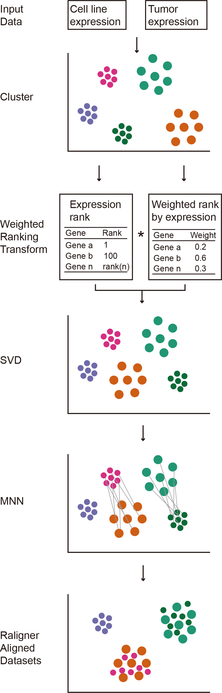

<!-- PROJECT LOGO -->
 

  

<h2 align="center">Raligner</h2>

  

    Raligner: enabling integrative alignment analysis for tumor and cell line cross-platform
     
     
     
  

<!-- TABLE OF CONTENTS -->

  
<h2 style="display: inline-block">Table of Contents</h2>

  
  <ol>
    <li>
      <a href="#about-the-project">About The Project</a>
    </li>
    <li><a href="#usage">Usage</a></li>
  </ol>

<!-- ABOUT THE PROJECT -->

## About The Project

  
  

Overview of the Raligner alignment method.

<!-- GETTING STARTED -->

## Usage

   [Demo](https://drive.google.com/uc?id=1SE3Db0Z9UYT1yvoQPcWJ9p8tz7NtcW1b&export=download) Demo for the use of raligner.

